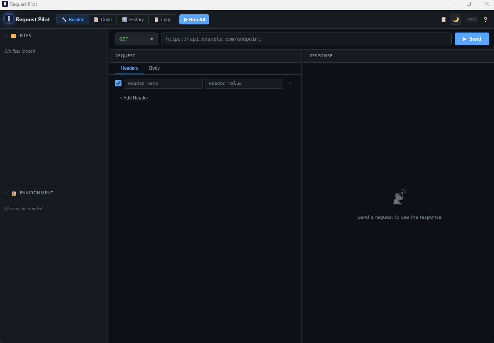

#  Request Pilot

A developer toolkit for HTTP traffic — a **Tauri v2 desktop app** for authoring and running E2E integration test suites from `.http` files, a **browser extension** for header injection, request blocking, and traffic analysis, a **terminal UI** for headless testing, and a **shared Rust core** that powers them all.

<p align="center">
  
</p>

## Architecture

```
request-pilot/
├── core/              # Shared Rust core library (223 tests)
│   └── src/
│       ├── http_parser.rs     # .http file parser & generator
│       ├── http_client.rs     # reqwest-based HTTP client
│       ├── test_runner.rs     # Suite executor with parallel scheduling
│       ├── assertions.rs      # Response assertion engine
│       ├── variables.rs       # Variable interpolation & built-ins
│       ├── azure_auth.rs      # Azure CLI + device code auth
│       ├── telemetry.rs       # OTEL telemetry (OTLP/HTTP JSON export)
│       ├── history.rs         # Request history store & filters
│       ├── url_trie.rs        # Segment-aware URL autocomplete trie
│       └── env_file.rs        # .env file reader/writer
├── desktop/           # Desktop GUI app (Tauri v2)
│   ├── ui/            # HTML/CSS/JS frontend (vanilla, no framework)
│   │   ├── app.js             # ~5200+ lines — full app logic
│   │   ├── index.html         # Main window layout
│   │   ├── popout.html        # Pop-out window template
│   │   └── styles.css         # Dark IDE theme
│   └── src-tauri/     # Rust backend (imports core)
│       └── src/lib.rs         # 20 Tauri IPC commands
├── extension/         # Browser extension (Edge/Chrome, Manifest V3)
│   ├── manifest.json
│   ├── background.js          # Rules engine, DNR, webRequest
│   ├── popup.html/css/js      # Extension popup UI
│   └── content-script*.js     # Response body interception
├── tui/               # Terminal UI (ratatui + crossterm)
│   └── src/
│       ├── main.rs, app.rs    # App state & event loop
│       ├── events.rs          # Keyboard/terminal events
│       └── ui.rs              # TUI rendering
├── docs/              # Documentation & sample .http files
├── tests/             # Jest unit tests for browser extension (97 tests)
├── .github/skills/    # AI skill for generating .http test files
├── Cargo.toml         # Workspace root (members: core, tui)
└── README.md
```

---

## Desktop App (Tauri v2)

A cross-platform HTTP client and **E2E integration test framework** — author requests, run structured test suites from enhanced `.http` files, and inspect responses. Built with Rust + Tauri v2 (HTML/CSS/JS frontend, Rust backend).

### Core Features

| Feature | Description |
|---|---|
| **REST Client–Compatible `.http` Format** | Top-level `@var = value` definitions and `{{var}}` references work in VS Code REST Client unmodified. Pilot extensions (`### @@setup`/`@@test`/`@@teardown` block markers, `# @@assert`/`# @@extract`/`# @@description`/`# @@disabled`/`# @@group`/`# @@depends`/`# @@mode`/`# @@dev_auth`/`# @@request-id`/`# @@compare`/`# @@step`/`# @@diff` directives) live inside comments REST Client ignores. Legacy `# @x` directives and `@variables` blocks remain accepted for backward compatibility. |
| **Test Runner** | Setup → Test → Teardown lifecycle; parallel execution via `tokio::JoinSet` with `@@group`/`@@depends` dependency graph (topological wave scheduling), **bounded wave scheduler** that caps live in-flight tasks via the file-level `# @@parallel <N>` directive (default 16, clamped to [1, 256]) so large suites don't exhaust sockets / connection pools, skip-on-failure |
| **Variables System** | Top-level `@name = value` (REST Client native) — also accepts `@variables` block (legacy). `.env` file integration, dynamic `# @@extract` from responses, built-in generators: `$timestamp`, `$datetime`, `$uuid`, `$guid`, `$randomInt`, `$randomInt min max`, `$processEnv VAR`, `$localHostname` |
| **Assertions** | ``# @@assert status == 200`, ``# @@assert $.field != null`, ``# @@assert $.items.length > 0` — 7 operators with JSON path support |
| **Run Modes** | Run All, Run Single Block, Run Group, Run File — all with live streaming progress |

### UI Modes

| Mode | Description |
|---|---|
| **🔧 Builder** | Form-based editor — method picker, URL bar, header rows, body type selector, response viewer with tabs |
| **📝 Code** | Full syntax-highlighted `.http` editor with line numbers; auto-scrolls to selected block with jump-back indicator |
| **📊 History** | Request history with multiple grouping modes (URL, domain→path, status, source, file→group→test hierarchy), hierarchical tree filter, URL autocomplete, request comparison, statistics |
| **📋 Logs** | Application log viewer with level filters (info/warn/error/debug), auto-scroll, live streaming |

### Response Viewer

| Feature | Description |
|---|---|
| **Smart Content Detection** | Auto-detects JSON, XML, HTML, YAML, CSV, protobuf from Content-Type + body heuristics |
| **JSON Tree Viewer** | Interactive expand/collapse at every level with syntax highlighting, Expand All / Collapse All |
| **XML/HTML Rendering** | Pretty-printed with tag, attribute, and comment highlighting |
| **Assertions Tab** | Pass/fail results per assertion with expected vs. actual values |

### Azure Authentication

Multi-scope Azure auth for developers — skip client-credentials setup blocks and authenticate with your own identity.

| Feature | Description |
|---|---|
| **Stateful Auth Button** | 🔒 Off → 🔓 Needs Auth (amber pulse) → 🔑 Authenticated (green) → ⚠ Expired (orange) |
| **Multi-Scope Support** | Auto-detects all ``# @@dev_auth <scope>` directives; caches tokens per scope |
| **3-Strategy Cascade** | 1) `az` CLI → 2) device code with file's `client_id` → 3) device code with Azure CLI public client |
| **``# @@mode app\|dev`** | `app` blocks run in normal mode (client credentials), `dev` blocks run in dev mode (user auth) |
| **``# @@dev_auth <scope>`** | Declares Azure scope per token-fetching setup block (e.g., `https://management.azure.com/.default`) |
| **Scope Tooltip** | Hover the auth button to see per-scope details and expiry times |

**Setup:**
1. Install [Azure CLI](https://learn.microsoft.com/en-us/cli/azure/install-azure-cli) and run `az login`
2. Annotate token-fetching setup blocks:
   ```http
   ### @@setup Fetch ARM Token
   # @@mode app
   # @@dev_auth https://management.azure.com/.default
   POST https://login.microsoftonline.com/{{tenant_id}}/oauth2/v2.0/token
   Content-Type: application/x-www-form-urlencoded

   grant_type=client_credentials&client_id={{client_id}}&client_secret={{client_secret}}&scope=https://management.azure.com/.default

   # @@extract arm_token = $.access_token
   ```
3. Click **🔒 Azure** in the toolbar — the app detects scopes, fetches tokens via `az account get-access-token`, and injects them as the block's `@extract` variables

### Additional Features

| Feature | Description |
|---|---|
| **Live Capture** | Connect desktop app to browser extension via WebSocket — forward live HTTP traffic in real-time with 3 modes: Off, All Requests, or Filtered (using extension rules). Captured requests auto-generate `.http` files and appear in history |
| **Extra Headers Injection** | Inject custom headers (auth tokens, trace IDs, API keys) into all test requests globally via a toolbar button; headers support `{{variable}}` interpolation |
| **Hierarchical Tree Filter** | Single multi-select dropdown with cascading checkboxes to filter history by file → group → test; replaces separate filter dropdowns for streamlined analysis |
| **Rocket Pilot Icon** | Rocket-pilot-in-cosmos SVG icon used across all platforms — desktop toolbar, taskbar, extension popup, and extension icons |
| **Pop-out Panels** | Detach History or Logs into separate native OS windows (Tauri WebviewWindow) for dual-monitor workflows |
| **Zoom Controls** | `Ctrl+Scroll` / `Ctrl++` / `Ctrl+-` / `Ctrl+0` with persistent level (50%–200%) |
| **URL Autocomplete** | Rust-backed trie with segment-aware fuzzy matching, Google-style ghost text, Tab completion |
| **Rich Hover Tooltips** | Block-level (request details, assertions, trend bar), group-level (test listing, stats), file-level (test plan, run stats) |
| **JWT/Token Decode** | Hover any variable to see decoded value; JWT tokens show header, claims, issuer, audience, expiry status |
| **Hierarchical Sidebar** | Files → Groups → Blocks with collapse/expand, status dots, count badges, ▶ Run buttons |
| **Block Progress Streaming** | Live pass/fail/skip updates during test execution |
| **Step Toggle** | Enable/disable blocks via sidebar checkbox or ``# @@disabled` directive |
| **Guided Tour** | Two-part onboarding tour covering all features; re-open via ❓ button |
| **Performance Engine** | Heavy computation (JSON formatting, tree building, diffing) offloaded to Rust with Rayon parallelism; virtual scrolling renders only visible rows (~50 DOM nodes for 100K+ lines); collapsed diff hunks show only changes + context; lazy JSON tree with on-demand expansion; Web Worker pool for off-thread text processing. See [Performance Migration Report](docs/PERFORMANCE_MIGRATION.md) |
| **Cross-Platform** | Windows, macOS, Linux via Tauri v2 |

### Live Capture

The desktop app can connect to the Request Pilot browser extension via a local WebSocket server (port `9718`). When active, HTTP requests intercepted by the extension are forwarded in real-time and automatically converted into `.http` file blocks. Three capture modes are available — **Off**, **All Requests**, and **Filtered** (only requests matching extension rules). Each capture session creates a virtual `.http` file in the sidebar that can be saved to disk, and every captured request is recorded in the History panel with the `extension-live` source tag.

### E2E Observability (OTEL Telemetry)

Export traces, metrics, and logs from every test run to any OTLP-compatible backend — Azure Monitor Application Insights, Jaeger, Grafana Tempo, etc.

**Setup:** Define well-known telemetry variables at the top of your `.http` file:
```http
@telemetry_traces_endpoint = https://otel-collector.example.com/v1/traces
@telemetry_metrics_endpoint = https://otel-collector.example.com/v1/metrics
@telemetry_logs_endpoint = https://otel-collector.example.com/v1/logs
@telemetry_token = my-bearer-token
@telemetry_service = my-api-e2e-tests
```

If any endpoint variable is set (non-empty), telemetry auto-enables. Endpoints can also be extracted dynamically via `@setup` steps (e.g., fetching OTLP endpoints from an ARM API response). Use `telemetry_token` for Bearer auth or `telemetry_api_key` for `x-ms-ikey` header.

> **⚠ RBAC Prerequisite (Azure Monitor):** Your identity must have the **Monitoring Metrics Publisher** role on the Data Collection Rule (DCR) associated with the App Insights resource. This grants `Microsoft.Insights/Metrics/Write` and `Microsoft.Insights/Telemetry/Write` dataActions required by the OTLP ingestion endpoints. Without this, telemetry export will fail with 403.

**Signals exported per run:**

| Signal | Structure | Purpose |
|--------|-----------|---------|
| **Traces** | Root span → block spans → HTTP request spans; assertions/extracts as span events | Failure investigation |
| **Metrics** | 5 metrics (3 counters + 2 exponential histograms), all DELTA temporality | Dashboards & alerts |
| **Logs** | Suite lifecycle, block completions, assertion failures, HTTP errors (severity-coded) | Debugging & auditing |

**Metrics reference:**

| Metric | Type | Temporality | Dimensions | Description |
|--------|------|-------------|------------|-------------|
| `rp.suite.runs` | Sum (monotonic) | DELTA | `file`, `outcome` | Count of suite executions |
| `rp.suite.duration` | ExponentialHistogram (scale=0) | DELTA | `file` | Suite execution time (ms) |
| `rp.block.runs` | Sum (monotonic) | DELTA | `file`, `block_type`, `outcome`, `block_name`, `group`* | Count of block executions |
| `rp.block.duration` | ExponentialHistogram (scale=0) | DELTA | `file`, `block_type`, `block_name`, `group`* | Block execution time (ms) |
| `rp.assertion.total` | Sum (monotonic) | DELTA | `file`, `outcome`, `block_name`, `group`* | Count of assertion evaluations |

*`group` is omitted when the block has no `@group` directive.

**Temporality & encoding:** All metrics use **DELTA** aggregation temporality — each data point represents the value for that reporting period, not a running total. Histograms use the **base-2 exponential** format (scale=0, bucket boundaries at powers of 2). Wire format is **OTLP protobuf** (`application/x-protobuf`).

**Aggregation levels:** Dimensions enable aggregation at test (`block_name`), group (`group`), and file (`file`) granularity. Outcome values: `passed`, `failed`, `errored`, `skipped`. Block types: `setup`, `test`, `teardown`.

**Grafana dashboard:** Import `docs/grafana/request-pilot-dashboard.json` — includes suite overview stats, trend charts, block outcome/type/assertion pie charts, duration bar gauges, file/group breakdowns, per-test detail table, and top-10 slowest tests. Uses `sum_over_time()` for DELTA-compatible PromQL.

**Desktop indicator:** The toolbar shows a 📡 OTEL button with states: configured (gray), sending (pulsing cyan), active (green ✓), error (red ✗). Hover for endpoint, per-file stats, and export errors. Toggle switch to pause telemetry without removing configuration.

**Zero new dependencies** — OTLP protobuf payloads are hand-encoded and sent via `reqwest` (already in the core crate). Telemetry never fails the test run — errors are captured in stats.

### Response Comparison (`@compare`)

Compare responses from two API endpoints within a single test block — ideal for API migration testing, A/B testing, and version parity checks. The `@compare` directive enables multi-step mode where named steps execute sequentially and a `@diff` directive computes a structured comparison between their responses.

**Syntax:**
```http
### @@test API Migration Parity
# @@compare

# @@step baseline
GET {{base_url}}/api/v1/users/{{user_id}}
Authorization: Bearer {{access_token}}

# @@assert status == 200

# @@step candidate
GET {{base_url}}/api/v2/users/{{user_id}}
Authorization: Bearer {{access_token}}

# @@assert status == 200

# @@diff baseline candidate
# @@assert $diff.match == true
# @@assert $diff.similarity >= 0.95
# @@assert $diff.changed_count == 0
```

**How it works:**
- ``# @@compare` — modifier on a `@test` block that enables multi-step comparison mode
- ``# @@step <name>` — defines a named step; each step has its own request, assertions, and extracts
- ``# @@diff <step_a> <step_b>` — triggers comparison between two named steps
- Steps execute sequentially; each step's assertions and extracts evaluate immediately
- Comparison assertions (`$diff.*`) evaluate after all steps complete
- JSON deep comparison with path-level diffs; text fallback with character-level similarity for non-JSON responses

**`$diff` variable reference:**

| Path | Type | Description |
|------|------|-------------|
| `$diff.match` | bool | `true` if responses are identical |
| `$diff.similarity` | float | 0.0–1.0 similarity score |
| `$diff.is_json` | bool | `true` if both responses are valid JSON |
| `$diff.added_count` | int | Number of paths only in step B |
| `$diff.removed_count` | int | Number of paths only in step A |
| `$diff.changed_count` | int | Number of paths with different values |
| `$diff.added_paths.length` | int | Length of added paths array |
| `$diff.removed_paths.length` | int | Length of removed paths array |
| `$diff.changed_paths.length` | int | Length of changed paths array |
| `$diff.changed_paths[N].path` | string | Path of Nth changed field |
| `$diff.changed_paths[N].left` | string | Step A value |
| `$diff.changed_paths[N].right` | string | Step B value |

**Use case — API migration testing:** When migrating from v1 to v2 of an API, use `@compare` to verify response parity. Each test run confirms the new endpoint returns equivalent data, and `$diff.similarity` lets you set a threshold for acceptable drift during incremental rollouts.

### Building & Running

**Prerequisites:** [Rust](https://rustup.rs/) (1.70+) and [Tauri CLI v2](https://v2.tauri.app/start/prerequisites/)

```bash
# Install Tauri CLI (first time only)
cargo install tauri-cli --version "^2"

# Run in development mode (compiles Rust + opens app with hot-reload)
cd request-pilot/desktop
cargo tauri dev

# Build production binary
cargo tauri build
```

> **Windows:** If you hit a file locking error (`os error 32`), run `$env:CARGO_BUILD_JOBS="1"` first.

**Platform dependencies:**
- **Windows**: Edge WebView2 (pre-installed on Win 10/11)
- **macOS**: Xcode CLI Tools (`xcode-select --install`)
- **Linux**: `sudo apt install libwebkit2gtk-4.1-dev libappindicator3-dev librsvg2-dev patchelf`

---

## `.http` Syntax Reference

Request Pilot **extends** the [VS Code REST Client](https://marketplace.visualstudio.com/items?itemName=humao.rest-client) `.http` format. The same file works in both tools — REST Client treats Pilot extensions as harmless comments, and Pilot understands REST Client's full syntax.

### REST Client compatible (works in both tools)

```http
# Comments use # or //
@base_url = https://api.example.com
@token = your-token-here

### A request, separated by ### or ---
# @name getUser
GET {{base_url}}/users/me
Authorization: Bearer {{token}}

---

@description Same separator, same effect
GET {{base_url}}/orgs
```

- **Variables:** top-level `@name = value` (the `=` is required).
- **References:** `{{name}}` — note **no `@` inside braces**.
- **Bare directives:** `@name foo`, `@description ...`, `@note ...`, `@prompt VAR description` (no `=`, distinguished from variables by absence of `=`).
- **Built-ins:** `{{$timestamp}}`, `{{$datetime}}`, `{{$uuid}}`, `{{$guid}}`, `{{$randomInt}}`, `{{$randomInt min max}}`, `{{$processEnv VAR}}`, `{{$localHostname}}`.
- **Separators:** `###` or `---` at start of a line (followed by space/EOL).
- **Comments:** `#` or `//`.

### Pilot extensions (namespaced under `@@`)

All Pilot-specific features sit inside comment lines with the `@@` prefix, so REST Client ignores them entirely:

```http
### @@setup Authenticate
# @@description Fetch OAuth2 token via client credentials
# @@mode app
# @@dev_auth https://api.example.com/.default
POST {{auth_url}}/token
Content-Type: application/x-www-form-urlencoded

grant_type=client_credentials&client_id={{client_id}}

# @@extract access_token = $.access_token
# @@assert status == 200

### @@test List Users
# @@group user-api
GET {{base_url}}/users
Authorization: Bearer {{access_token}}

# @@assert status == 200
# @@assert $.value.length > 0
```

| Marker | Meaning |
|---|---|
| `### @@setup Title` / `### @@test Title` / `### @@teardown Title` | Block type (sequential / parallel-safe / sequential cleanup) |
| `# @@assert <path> <op> <value>` | Validate response (`==`, `!=`, `>`, `<`, `>=`, `<=`, `contains`) |
| `# @@extract <name> = <jsonpath>` | Save response value into a variable |
| `# @@group <name>` | Run together in parallel |
| `# @@depends <name>` | Wait for another group/block |
| `# @@disabled` | Skip this block |
| `# @@mode app\|dev` | Run only in app or dev (Azure CLI) auth mode |
| `# @@dev_auth <scope>` | Azure scope used when dev mode replaces this token-fetch |
| `# @@auto_run <duration>` | Periodically re-run the suite |
| `# @@request-id [header]` | Auto-inject a fresh UUIDv4 into every request under `header` (default `X-Request-Id`). Per-block override: `# @@request-id X-Other`. Opt out: `# @@request-id off`. |
| `# @@compare` + `# @@step <name>` + `# @@diff <a> <b>` | Multi-step request comparison |
| `# @@telemetry` / `# @@telemetry_token` / `# @@telemetry_service` | OTEL exporter binding |

`// @@directive` is also accepted as an alias for `# @@directive`.

### Backward compatibility

- Legacy single-`@` directives (`# @assert`, `# @extract`, `### @setup …`) are still accepted by the parser indefinitely.
- The legacy `@variables` block is still accepted; it’s simply equivalent to a sequence of top-level `@name = value` definitions.
- The generator only emits the new syntax — round-tripping a file through Pilot will normalize it.

---

## Environments (`.env` files)

Request Pilot keeps environment handling simple: **committed defaults live
inside your `.http` file**, and **per-environment overrides live in plain
`.env` files** that users load at runtime.

### Where variables come from (precedence, high → low)

1. Runtime `# @@extract` from prior blocks.
2. In-app **Variables** panel (interactive edits).
3. The currently-active `.env` file.
4. Top-level `@name = value` definitions in the `.http` file.

A `.env` value will only shine through if the `.http` file didn't already hard-code one in the Variables panel — that's by design so a committed default can always win if a developer wants it to.

### `.env` file format

Standard `KEY=VALUE` lines. Comments start with `#`. Values may be quoted.
Files remain fully compatible with `dotenv`, `docker --env-file`, etc.

```env
# @@name staging
BASE_URL=https://staging.example.com
AUTH_SCOPE=https://staging.example.com/.default
CLIENT_ID=staging-client-id
```

The optional `# @@name <name>` directive names the environment for display
(`staging` above). It lives in a comment, so plain `.env` consumers ignore
it. If omitted, the filename stem (e.g. `prod.env` → `prod`) is used.

### Multiple envs, one active at a time

- Load as many `.env` files as you need (`dev.env`, `staging.env`,
  `prod.env`, `regional-prod-eu.env`, …).
- Exactly **one** is active at any moment. The first loaded auto-activates.
- The list + active choice persist across restarts
  (`<config_dir>/request-pilot/env_config.json`).

### Desktop

- 🌐 **Environment dropdown** in the toolbar shows the active env.
- Click it to list loaded files, switch active, remove an entry, or click
  **+ Load .env file** to add another.

### TUI

- <kbd>Ctrl</kbd>+<kbd>E</kbd> — load/add a `.env` file (auto-activates if first).
- <kbd>Ctrl</kbd>+<kbd>P</kbd> — open the env picker overlay.
  - <kbd>j</kbd>/<kbd>k</kbd> navigate, <kbd>Enter</kbd> activate,
    <kbd>a</kbd> add, <kbd>d</kbd> remove, <kbd>Esc</kbd> close.
- Active env shows as `🌐 {name}` at the start of the status bar.

### Samples

See [`docs/samples/dev.env`](docs/samples/dev.env) and
[`docs/samples/prod.env`](docs/samples/prod.env).

---

## Sessions — Persisted Test Runs

Request Pilot can persist every test-suite run to a local directory so you
can browse historical results, drill into individual request/response
pairs, and **load a session back as a snapshot** — the exact `.http`
source plus block statuses, captured request/response payloads, and
assertion outcomes from the moment of the run.

- **Off by default** — set a sessions folder in *🗂 Sessions → ⚙ Settings*
  (with a native Browse button) to start recording. The desktop and TUI
  share one `sessions_config.json` (root, auto-record, capture preset).
- **📸 Snapshot preset** *(default)* — full request and response bodies
  (capped at 10 MB), names-only variables, sensitive headers/query
  params auto-redacted. Two other presets in Settings: 🔒 Privacy-first
  (drops request bodies) and 🐛 Full debug (no redaction).
- **Snapshot loading** — clicking a session row opens it as a read-only
  snapshot. **🔓 Detach** unlocks it; **▶ Replay all** re-runs with
  confirmation and creates a new session under the same `file_id`.
- **Stats auto-computed per run** — per-`(file_id, sha)` and per-file
  `stats.json` rollups (totals, hourly 24h / daily 30d buckets,
  per-block aggregates, latency p50/p95/p99/max), updated incrementally
  on every run. Desktop has a **📊 Stats** tab in the session detail
  plus an inline pass-rate strip on each version group.
- **TUI Sessions tab** — press **S** or **F4** for a three-pane
  groups / sessions / detail view with group-by, status filter, search,
  refresh, and full snapshot parity: **Enter** to load, **Shift-R** to
  replay all, **r** to replay a single block, **D** to detach.
- **Content-addressed** — each unique source content (LF-normalized
  `sha256`) gets its own version directory; old versions stay intact.
- **Crash-safe** — every write goes through a temp file + atomic rename.
- **Sortable run-ids** — UUIDv7.
- **Retention & body redaction** — optional `retention` caps
  (`max_age_days` / `max_sessions_per_version` / `max_total_size_gb`)
  applied at desktop startup and via `request-pilot sessions prune`;
  `# @@redact body $.path` (JSONPath) / `# @@redact body /regex/`
  directives plus a global `body_redaction_paths` config to strip
  secrets out of recorded bodies.

### Command-line tool (`request-pilot`)

The `cli/` workspace builds a `request-pilot` binary that operates on
the same sessions store as the desktop and TUI:

```bash
$ request-pilot sessions list --since 24h
$ request-pilot sessions show <run-id> [--json]
$ request-pilot sessions stats <file-id> [--sha <sha>] [--json]
$ request-pilot sessions export <run-id> --format md -o run.md
$ request-pilot sessions replay <run-id> [--block <name>] [--env <path>]
$ request-pilot sessions prune --older-than 30d --keep-last 50 [--dry-run] [--force]
```

See [`docs/sessions.md`](docs/sessions.md) for the full layout, capture
presets, snapshot/replay workflow, CLI reference, retention rules, and
body-redaction syntax.

---

## Browser Extension (Edge/Chrome)


A Manifest V3 extension for intercepting, modifying, and analyzing HTTP traffic.

### Rules Engine
| Feature | Description |
|---|---|
| **Header Injection** | Add or overwrite request headers on matching URLs |
| **Request Blocking** | Block requests to specific endpoints entirely |
| **URL Redirect** | Redirect matching requests to a different URL |
| **Method Filtering** | Restrict rules to specific HTTP methods (GET, POST, etc.) |
| **Import / Export** | Share rule configurations as JSON files |
| **Toggle Rules** | Enable or disable individual rules without deleting |

### Network Monitoring
| Feature | Description |
|---|---|
| **Rule-Filtered Log** | Only shows requests matching your configured rules |
| **Similarity Scoring** | Select a request to see match % on others based on headers + payload |
| **Request Comparison** | Select 2 requests → side-by-side diff of headers, body (JSON key-by-key) |
| **Response Body Capture** | Intercepted via content scripts (MAIN + ISOLATED world) with re-fetch fallback |
| **Method & Status Filters** | Filter by HTTP method and status code range |
| **Group By** | Group entries by URL or any request/response header |
| **Log Export / Import** | Export as JSON, import JSON or HAR files |

### Statistics
| Feature | Description |
|---|---|
| **Summary Cards** | Total requests, success, client errors, server errors, rule coverage |
| **Response Time Percentiles** | Avg, P50, P90, P95, P99, Max |
| **Domain & Path Tree** | Collapsible accordion with rule impact badges and one-click Add Rule |

### Installation
1. Open Edge → `edge://extensions/` (or Chrome → `chrome://extensions/`)
2. Enable **Developer mode**
3. Click **Load unpacked** → select the **`request-pilot/extension`** folder
4. The Request Pilot icon appears in your toolbar

> **Important:** Select the `extension` subfolder, not the root directory.

---

## Terminal UI (TUI)

A full-featured terminal interface for HTTP testing — same core engine as the desktop app, runs entirely in your terminal.

### Running

```bash
# Build
cd request-pilot
cargo build -p request-pilot-tui

# Run with .http files
cargo run -p request-pilot-tui -- api.http

# Multiple files (repeatable -f flag)
cargo run -p request-pilot-tui -- -f api.http -f tests.http

# Load environment variables
cargo run -p request-pilot-tui -- api.http --env .env
# or short form
cargo run -p request-pilot-tui -- api.http -e .env

# Auto-run tests on startup
cargo run -p request-pilot-tui -- api.http --run
```

### Modes

The TUI has **4 modes**, switched with the global keys below:

| Mode | Key | Description |
|------|-----|-------------|
| **Files** | `f` | File tree sidebar + builder panel + response viewer (default) |
| **Code** | `c` | Full-screen syntax-highlighted editor with search, goto line, selection |
| **History** | `h` | Request history with 6 grouping modes, method/status filters, compare diff |
| **Logs** | `l` | Application log viewer with level filters and auto-scroll |

### Key Features

| Feature | Description |
|---|---|
| **File Tree Sidebar** | Hierarchical files → groups → blocks with ⇄ icon for compare blocks, auto-scroll, expand/collapse |
| **Builder Panel** | Method picker, URL bar, headers, body, assertions, extracts — with compare-aware view showing steps |
| **Code Editor** | Full editing with syntax highlighting for all directives including `@compare`/`@step`/`@diff`, search (`/`), goto (`Ctrl+G`), selection (`Shift+Arrow`), cut/copy/paste |
| **Response Viewer** | Body (JSON tree with expand/collapse), Headers, Assertions tabs — compare blocks show per-step results with diff summary |
| **Diff Viewer** | Side-by-side and changes-only modes, character-level highlighting, `n`/`N` navigation between diffs |
| **Test Runner** | Async execution with progress bar, spinner, live streaming — supports setup/test/teardown, `@group`/`@depends` |
| **Variables Panel** | Sidebar tab (`V` to toggle) with add/edit/delete, `.env` file loading |
| **History Mode** | 6 grouping modes (Flat, Domain, Status, Source, FileGroup), method/status filter popups, `Space` to select 2 entries + `d` for diff comparison |
| **Extension Connector** | WebSocket bridge to browser extension (port 9718) — 3 modes: Off/All/Filtered, captured requests appear in sidebar as 📡 `live-capture.http` |
| **OTEL Telemetry** | Toggle OTEL export, shows endpoint/stats in popup (`Ctrl+T`) |
| **Azure Auth** | CLI-based token fetch, dev mode toggle, scope detection (`Ctrl+A`) |
| **Extra Headers** | Global header injection with enable/disable per header (`Ctrl+H`) |
| **3 Themes** | Cycle with `T` — Catppuccin Mocha, dark, and light palettes |
| **Splash Screen** | Animated rocket launch with exhaust effects on startup |
| **Focus Indication** | Subtle background highlight on the focused panel |

### Keybindings

#### Global

| Key | Action |
|-----|--------|
| `q` | Quit |
| `?` | Toggle help overlay |
| `f` | Files mode |
| `h` | History mode |
| `l` | Logs mode |
| `c` | Code editor |
| `T` | Cycle theme |
| `V` | Toggle sidebar (Files ↔ Variables) |
| `R` / `F5` | Run all tests |
| `Tab` | Cycle focus between panels |
| `Esc` | Navigate back one level |

#### File Operations

| Key | Action |
|-----|--------|
| `o` / `Ctrl+O` | Open `.http` file |
| `n` / `Ctrl+N` | New file |
| `s` / `Ctrl+S` | Save file |
| `x` | Close file |
| `Ctrl+E` | Load `.env` file |

#### Toolbar Shortcuts

| Key | Action |
|-----|--------|
| `Ctrl+H` | Extra headers popup |
| `Ctrl+A` | Azure auth popup |
| `Ctrl+T` | OTEL telemetry popup |
| `Ctrl+L` | Extension connector popup |

#### File Tree

| Key | Action |
|-----|--------|
| `j`/`k` / `↑`/`↓` | Navigate |
| `Enter` | Select block / expand file |
| `Space` | Toggle expand |
| `r` | Run selected |
| `e` | Edit in code editor |
| `t` | Toggle disabled |
| `1-9` | Quick jump to file |

#### Response

| Key | Action |
|-----|--------|
| `b` / `H` / `a` | Body / Headers / Assertions tab |
| `y` | Copy response body |
| `D` | Open diff viewer (compare blocks) |
| `Enter` | Expand/collapse JSON node |
| `E` / `C` | Expand all / Collapse all |

#### History

| Key | Action |
|-----|--------|
| `g` | Cycle grouping mode |
| `m` | Method filter popup |
| `s` | Status filter popup |
| `/` | URL search filter |
| `Space` | Select for compare (max 2) |
| `d` | Diff selected entries |
| `Enter` | View detail overlay |

#### Diff Viewer

| Key | Action |
|-----|--------|
| `n` / `N` | Next / previous diff |
| `m` | Toggle side-by-side / changes-only |
| `Esc` / `q` | Close |

---

## Shared Core (`request-pilot-core`)

The Rust library powering all three frontends — **223 unit tests**, zero warnings.

| Module | Description |
|---|---|
| **`http_parser`** | Parse and generate `.http` files — REST Client compatible (`@var = value`, `{{var}}`, bare `@name`/`@description`/`@note`/`@prompt` directives, `###`/`---` separators, `#`/`//` comments) plus Pilot extensions (`### @@setup`/`@@test`/`@@teardown` blocks; `# @@assert`/`# @@extract`/`# @@group`/`# @@depends`/`# @@mode`/`# @@dev_auth`/`# @@disabled`/`# @@telemetry`/`# @@compare`/`# @@step`/`# @@diff` directives). Dual-reads legacy `# @x` syntax. |
| **`test_runner`** | Execute test suites — setup → parallel tests (topological wave scheduling via `@@group`/`@@depends`) → teardown, with streaming progress events and OTEL telemetry export |
| **`http_client`** | reqwest-based async HTTP with variable interpolation, smart URL encoding |
| **`assertions`** | Evaluate `# @@assert` directives — 7 operators (`==`, `!=`, `>`, `<`, `>=`, `<=`, `contains`), JSON path selectors, status/header/body targets |
| **`variables`** | Variable store with `{{interpolation}}`, REST Client-compatible built-ins (`$timestamp`, `$datetime`, `$uuid`, `$guid`, `$randomInt`, `$randomInt min max`, `$processEnv VAR`, `$localHostname`), `.env` merge, unresolved detection |
| **`azure_auth`** | Azure CLI token fetch (`az`/`az.cmd`), device code flow (start + poll), availability detection |
| **`telemetry`** | OTEL observability — build OTLP protobuf payloads (traces, metrics, logs) and export to Azure Monitor Application Insights or any OTLP-compatible backend. Zero new dependencies. 5 metrics (3 DELTA counters, 2 DELTA exponential histograms) with test-level dimensions, hierarchical trace spans, structured logs |
| **`history`** | In-memory history store (max 1000), filtering by method/status/URL/source/run_id, trie-based URL autocomplete |
| **`url_trie`** | Segment-aware trie — split URLs by `/`, `.`, `:`, `?`, `&`, `=` for frequency-ranked autocomplete and domain→path grouping |
| **`env_file`** | Parse/write `.env` files with quotes, comments, and sorted output |

### Running Tests

```bash
# Core library tests (223 tests — parser, assertions, variables, runner, history, url_trie, http_client, telemetry)
cd request-pilot
cargo test -p request-pilot-core

# Desktop adapter check
cd request-pilot/desktop/src-tauri
cargo check

# Browser extension tests (97 tests)
cd request-pilot/tests
npm install && npm test
```

---

## Documentation & Samples

The [`docs/`](docs/) folder contains:
- **[`.http` File Format Reference](docs/http-file-format.md)** — complete guide to variables, block types, directives, assertions, extracts, and interpolation
- **[Sample `.http` files](docs/samples/):**
  - [`azure-managed-prometheus.http`](docs/samples/azure-managed-prometheus.http) — PromQL queries, rule groups, and alert rules
  - [`azure-aks-cluster.http`](docs/samples/azure-aks-cluster.http) — AKS cluster operations: node pools, upgrade profiles, credentials
  - [`azure-aks-prometheus-monitoring.http`](docs/samples/azure-aks-prometheus-monitoring.http) — AKS + Prometheus E2E monitoring

### Architecture Guides

For developers and AI agents working on the codebase:
- **[ARCHITECTURE.md](ARCHITECTURE.md)** — High-level overview, repo layout, data flows, performance architecture, common modification patterns
- **[desktop/ARCHITECTURE.md](desktop/ARCHITECTURE.md)** — Rust module-by-module guide, frontend structure, IPC commands
- **[extension/ARCHITECTURE.md](extension/ARCHITECTURE.md)** — Extension internals, message passing, rule system, content scripts
- **[Performance Migration Report](docs/PERFORMANCE_MIGRATION.md)** — Why Rust+Rayon over Dioxus, benchmarks, virtual scroll impact, test coverage

### AI Skill

The `.github/skills/e2e-http-test-generator/` directory contains a Copilot skill for generating `.http` test files from code changes. It analyzes diffs, PRs, or commits to produce structured test files following all Request Pilot conventions.

---

## Tech Stack

| Layer | Technologies |
|---|---|
| **Shared Core** | Rust, reqwest, tokio, serde, chrono, rayon |
| **Desktop App** | Tauri v2, HTML/CSS/JS (vanilla), Rust backend, Web Workers |
| **Browser Extension** | Manifest V3, declarativeNetRequest, webRequest, content scripts, chrome.storage |
| **Terminal UI** | ratatui 0.29, crossterm 0.28, clap 4, tokio |
| **Tests** | Rust `#[test]` (223 core + 62 perf unit + 22 perf E2E), Jest (97 extension + 42 perf features) |
